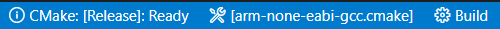

# STM32-CMake

CubeMX, cmake, vscode, openocd, Cortex-Debug 工作流模板

## 新工程配置

### 在 CubeMX 中新建工程

使用 CubeMX 生成一个 Project，其中：

- Toolchain / IDE 选择 Makefile
- Code Generator 中选择 Copy only the necessary library files
- Generated files 勾选 Generate peripheral initialization as a pair of '.c/.h' files per peripheral

### 复制文件

复制以下文件和文件夹到上一步生成的工程目录中：

```
.vscode
.gitignore
arm-none-eabi-gcc.cmake
CMakeLists.txt
jlink-sw.cfg
```

### 配置

1. 用 VS Code 打开新工程的文件夹
2. 参照新工程的 Makefile 文件，修改 CMakeLists.txt 中的 [TO DO] 部分（该文件主要用于编译）

   > Tips: 在 VS Code 中可以右键选择文件-复制相对路径
   >
3. 修改 .vscode\tasks.json 文件的 `"label": "Build & Flash"` 部分（该部分用于烧录）
4. 修改 .vscode\launch.json 文件（该文件主要用于调试）

   如果使用 openocd，则只需要修改以下部分

   ```json
   "configFiles": [
   	"jlink-sw.cfg",
   	"target/stm32l4x.cfg"
   ]
   ```

   如果在 CMakeLists.txt 中修改了工程名，则还需要修改以下部分

   ```json
   "executable": "./build/stm32_cmake.elf"
   ```

### 编译

1. 在底栏工具部分选择 arm-none-eabi-gcc.cmake （需要安装 CMake Tools 插件）
2. 点击 Build 或者按 F7 （默认快捷键）
    

### 烧录

Ctrl + Shift + B（默认快捷键）, 选择 Build & Flash

*（或者：菜单栏-终端-运行生成任务-Build & Flash）*

> Tips: 可以在菜单栏-终端-配置默认生成任务，选择 Build & Flash，之后 Ctrl + Shift + B 就可以直接烧录

### Debug

按 F5
